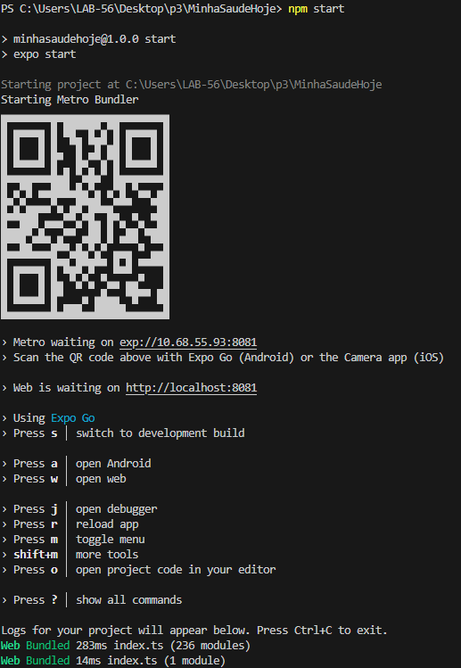

# Minha Saúde Hoje - P3 Programação de Dispositivos Móveis I

Dashboard de monitoramento de saúde desenvolvido com React Native (Expo) e TypeScript para a disciplina de Programação de Dispositivos Móveis I.

## Como iniciar a aplicação?
 ```bash

# Clonar o repositório
git clone https://github.com/RafaelSM21/p3_mobile_I.git

# Entrar na pasta da aplicação
cd p3_mobile_I

# Instalar as dependencias
npm i

# Iniciar a aplicação
npm start
```

## Abrir a aplicação:

### Web 

- Acesse http://localhost:8081

### Mobile

- Baixe o App "Expo Go" em seu Smartphone e acesse o qrcode gerado após o comando "npm start"

- Saída esperada apos o início da aplicação:
  
  

## Funcionalidades

### Visualização de indicadores de saúde simulados:

- Passos diários

- Horas de sono

- Nível de hidratação (em litros)

- Frequência cardíaca (bpm)

- Atualização automática dos dados a cada 15 segundos

- Botão "Ver mais informações" que abre uma página externa

- Design responsivo e cards com sombras (shadow tree)

- Tipagem estática com TypeScript
